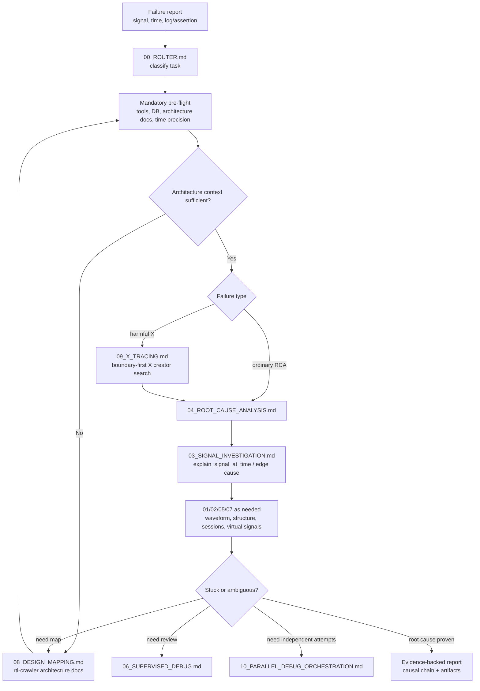

# auto_waveform_debugger

An AI-native platform for automated RTL waveform debugging. It combines
**structural RTL tracing** with **temporal waveform evidence** so an AI agent can
start from a failing signal at a failing time, inspect the upstream logic cone,
sample real waveform values, and rank plausible root-cause candidates.

The project is built around one idea: source code alone is not enough for RTL
debug. The agent should use the design structure, waveform history, session
state, and documented debug playbooks together.

## Architecture

Runtime components:

| Component | Binary / Entry | Language | Role |
|---|---|---|---|
| `standalone_trace/` | `build/rtl_trace` | C++20 + slang | Parse/elaborate RTL, build a binary graph DB, answer structural driver/load/hierarchy queries |
| `waveform_explorer/` | `build/wave_agent_cli` | C++17 | Query VCD/FST/FSDB waveform data and return structured JSON |
| `agent_debug_automation/` | `agent_debug_automation_mcp.py` | Python + FastMCP | MCP service that combines structural and temporal backends, sessions, ranking, virtual signals, and cross-link tools |
| `agent_debug_textbook/` | Markdown playbooks | Docs | Operating procedure for AI agents: routing, RCA, X tracing, design mapping, supervised debug, and parallel orchestration |
| `skills/rtl_crawler*/` | Codex skills | Python / docs | Design-mapping workflows that generate architecture docs before deep debug |

```
                         agent_debug_textbook/
                         (router + playbooks)
                                  |
                                  v
                         +---------------------+
                         | AI Agent / MCP host |
                         +----------+----------+
                                    |
                                    v
                         +-----------------------------+
                         | agent_debug_automation_mcp  |
                         | sessions, mapping, ranking, |
                         | virtual signals, cross-link |
                         +------------+----------------+
                                      |
                     +----------------+----------------+
                     |                                 |
                     v                                 v
           +------------------+              +------------------+
           | rtl_trace         |              | wave_agent_cli   |
           | structural graph  |              | VCD/FST/FSDB     |
           | drivers / loads   |              | temporal values  |
           +------------------+              +------------------+
```

## Agent Debug Textbook

`agent_debug_textbook/` is the project-level debug procedure. It tells agents
which tools to use, when to build architecture context, how to avoid bad
assumptions, and how to document evidence-backed root causes.



Important playbook rules:

- Start with `00_ROUTER.md`; do not skip pre-flight.
- Confirm waveform time precision before any time-based query.
- Prefer MCP structural/waveform tools over manual RTL source reading.
- Build or reuse architecture docs before deep tracing opaque subsystems.
- Trace driver cones layer by layer until the root cause is proven.
- Treat vendor VIP protocol checkers as golden, but not home-grown scoreboards
  or models.
- In parallel mode, the Orchestrator pre-creates/verifies per-agent sessions,
  warms the waveform once, strips orchestration-only directives from the child
  prompt, launches independent Debugger agents, and aggregates every result.

Key files:

| File | Purpose |
|---|---|
| `agent_debug_textbook/rtl_debug_guide.md` | High-level RTL debug process and rules |
| `agent_debug_textbook/00_ROUTER.md` | Mandatory pre-flight and playbook routing |
| `agent_debug_textbook/04_ROOT_CAUSE_ANALYSIS.md` | Main structural + temporal RCA flow |
| `agent_debug_textbook/08_DESIGN_MAPPING.md` | Architecture-doc escalation through crawler flow |
| `agent_debug_textbook/09_X_TRACING.md` | Harmful-X boundary tracing workflow |
| `agent_debug_textbook/10_PARALLEL_DEBUG_ORCHESTRATION.md` | Independent multi-agent debug orchestration |

## Core Capabilities

| Capability | Representative tools / files |
|---|---|
| Structural tracing | `rtl_trace compile`, `trace`, `find`, `hier`, `whereis-instance`, `serve` |
| Waveform browsing | `list_signals`, `get_signal_info`, `get_snapshot`, `get_transitions`, `find_edge`, `find_condition` |
| Cross-link analysis | `trace_with_snapshot`, `explain_signal_at_time`, `rank_cone_by_time`, `explain_edge_cause` |
| Session state | `create_session`, cursor, bookmarks, signal groups, file-locked session store |
| Virtual signals | Expression signals, bus concat/slice/split/reverse, cached evaluation |
| Multi-agent safety | Per-agent sessions, serialized backend access, parallel debug report aggregation |

## Module Structure

### `standalone_trace/`

```
standalone_trace/
  main.cc                  # subcommand dispatch
  AssignmentUtils.cc/.h    # assignment text inference utilities
  compile/                 # slang elaboration -> graph DB compile flow
  db/                      # graph DB read/write, types, shared query logic
  query/                   # trace, hier, find, whereis-instance commands
  serve/                   # interactive serve loop
  tests/                   # CTest semantic regression
```

### `waveform_explorer/`

```
waveform_explorer/
  src/
    main.cpp               # CLI / daemon entry
    WaveDatabase.*         # core waveform backend
    AgentAPI.*             # JSON query layer
    FormatRegistry.*       # extension -> adapter dispatch
    vcd/ fst/ fsdb/        # waveform format adapters
  waveform_mcp.py          # standalone waveform MCP subset
  tests/                   # Python waveform command regressions
```

### `agent_debug_automation/`

```
agent_debug_automation/
  agent_debug_automation_mcp.py  # backward-compatible entry wrapper
  server.py                      # FastMCP app init
  tools.py                       # MCP tool handlers
  clients.py                     # rtl_trace / wave_agent_cli process clients
  sessions.py                    # cursor/bookmark/group persistence
  mapping.py                     # structural path <-> waveform path mapping
  ranking.py                     # cone ranking heuristics
  expression_parser.py           # Verilog-like expression parser
  expression_evaluator.py        # 4-state expression evaluator
  virtual_signals.py             # virtual signal service and caching
  tests/                         # cross-link, expression, virtual signal tests
```

## Build

Set up the shared Python environment from the repo root:

```bash
python3 -m venv .venv
.venv/bin/python3 -m pip install --upgrade pip
.venv/bin/python3 -m pip install -r requirements.txt
```

Build native components:

```bash
(cd standalone_trace && cmake -B build -GNinja . && ninja -C build)
(cd waveform_explorer && cmake -B build . && cmake --build build -j"$(nproc)")
```

For FSDB support, build `waveform_explorer` with the local Verdi installation:

```bash
(cd waveform_explorer && cmake -B build -DVERDI_HOME=/path/to/verdi -DENABLE_FSDB=ON . && cmake --build build -j"$(nproc)")
```

## Run MCP Service

```bash
.venv/bin/python3 agent_debug_automation/agent_debug_automation_mcp.py
.venv/bin/python3 -m agent_debug_automation.agent_debug_automation_mcp
```

## Tests

Run the narrowest relevant suite first:

```bash
# standalone_trace
ctest --test-dir standalone_trace/build --output-on-failure

# waveform_explorer
.venv/bin/python3 -m unittest waveform_explorer.tests.test_signal_overview
.venv/bin/python3 -m unittest waveform_explorer.tests.test_waveform_commands

# agent_debug_automation
.venv/bin/python3 -m unittest agent_debug_automation.tests.test_cross_linking

# Integration scenarios, tc01-tc27
(cd test_cases && ./run_all_tests.sh)
```

## Multi-Agent Concurrency Model

- Multiple agents can share one read-only RTL graph DB and one waveform through
  the MCP service.
- The MCP layer reuses backend daemons and serializes each request/response
  transaction so stdout/stdin protocols do not interleave.
- Structural DB rebuilds use advisory locking so readers do not observe a
  partially written DB.
- Session state is stored under `agent_debug_automation/.session_store` with
  file locking and atomic reload-mutate-save updates.
- The active Session pointer is global for backward compatibility. Independent
  agents must pass explicit `waveform_path` / `vcd_path` and `session_name`.

## Key Documentation

| File | Content |
|---|---|
| `docs/MCP_SIGNATURES.md` | MCP tool API contract |
| `docs/PROJECT_CAPABILITIES.md` | Capability summary for AI agents |
| `docs/PROJ_DESC.md` | Architecture overview and implementation concepts |
| `docs/TEST.md` | Test documentation |
| `docs/failure_history.md` | Regression history for past bugs |
| `agent_debug_automation/README.md` | Python MCP layer usage |
| `standalone_trace/README.md` | `rtl_trace` CLI usage |
| `waveform_explorer/README.md` | Waveform engine usage and format notes |
| `agent_debug_textbook/` | Agent-facing debug process and playbooks |
| `skills/rtl_crawler/` | Single-agent RTL architecture crawler skill |
| `skills/rtl_crawler_multi_agent/` | Explicitly authorized multi-agent crawler skill |
